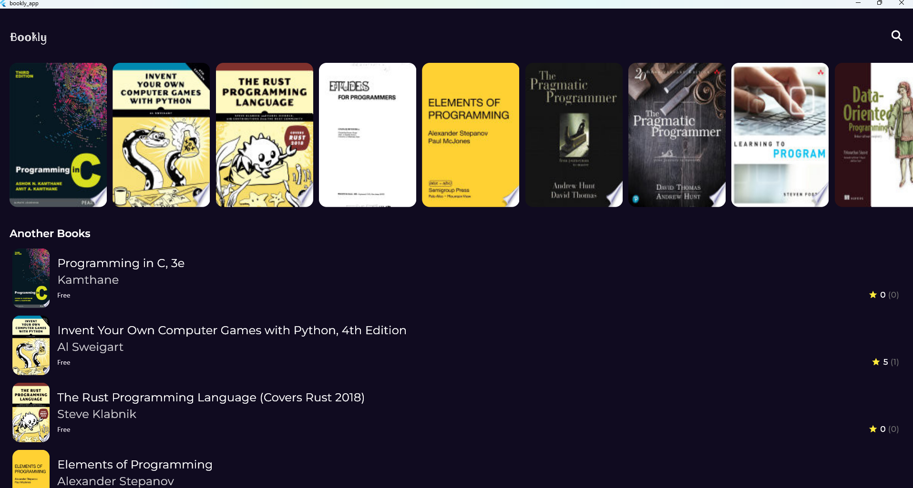
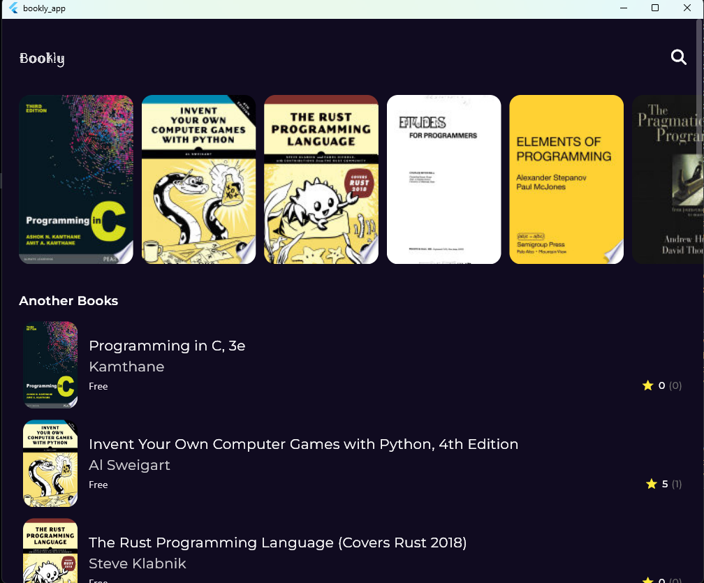
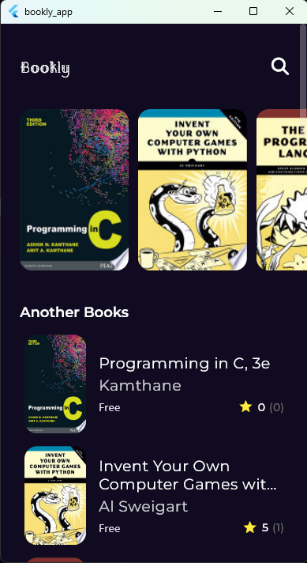
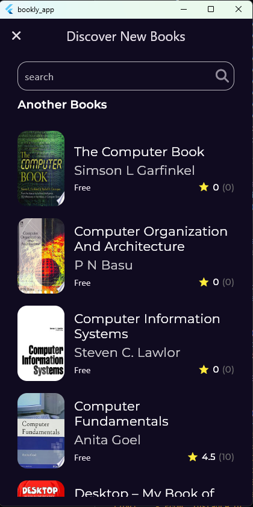
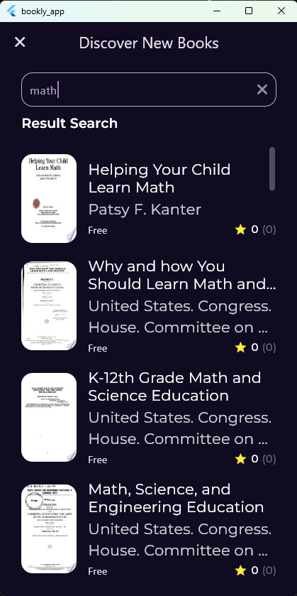
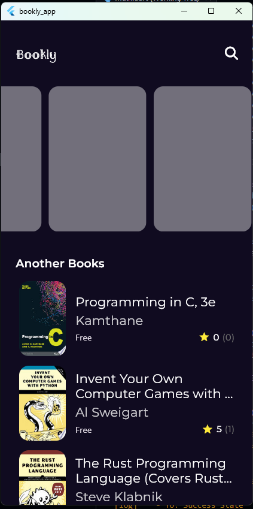
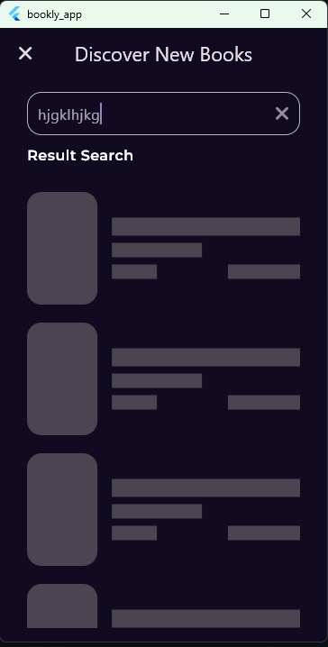
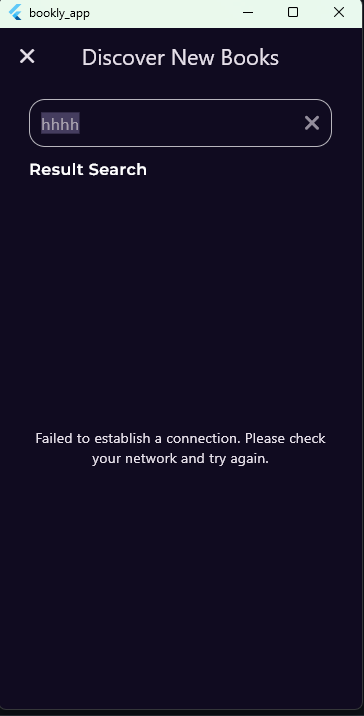
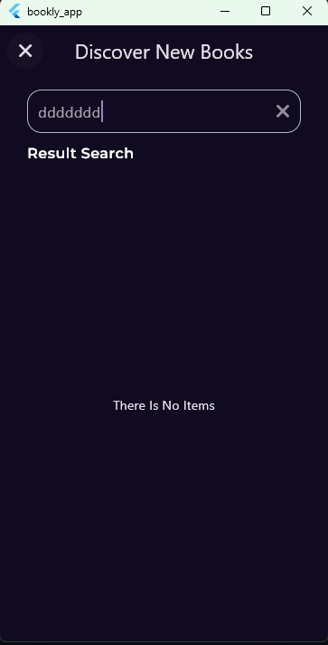

### **App: Books App**

Welcome to **Books App**! 📚 This app is designed to provide a seamless experience for browsing and reading books. With advanced features and a clean architecture, this app delivers a fast and flexible user experience for all book lovers! ✨

---

## **🌈 Features 🌈**

### 1. **Clean Architecture 🛠️✨**

We’ve built the app using **Clean Architecture**, ensuring a scalable and maintainable structure. This approach allows us to separate concerns, making the app easy to update and extend in the future.

---

### 2. **Responsive Design 📱💻**

The app adapts to all screen sizes, from small phones to large tablets and laptops. Whether you’re using a phone or a bigger screen, you’ll enjoy a smooth and intuitive experience. 📐

Responsive design ensures that the app automatically adjusts its layout to fit your device, providing an optimal experience for all screen sizes.

  
  

---

### 3. **Search with Title and Debouncer 🔍📚**

Find books quickly by searching with their titles. Thanks to the **debouncer**, the app waits for your input before searching, ensuring better performance and fewer unnecessary API calls.

This feature improves the efficiency of your search and eliminates unnecessary delays. The debouncer helps to only trigger searches when you stop typing, ensuring that you get the most relevant results.

---

### 4. **Integration with Sources 🌐✨**

Browse a wide selection of books directly from various online sources. Whether you're looking for e-books or printed editions, the app offers an extensive library for you to explore.

---

### 5. **Pagination ⏳📜**

To ensure smooth data loading, the app uses **pagination**. As you scroll through the book list, new data is loaded incrementally, providing a seamless browsing experience without long waiting times.

This feature makes browsing faster by loading smaller sets of data as you scroll, improving the app's responsiveness.

---

### 6. **Custom Loading Effect 🌀✨**

The app includes a **custom loading effect** that visually enhances the user experience when fetching data. Instead of showing a boring loading screen, we provide a more engaging and dynamic loading animation.

This feature adds a touch of creativity to the app, making waiting feel less tedious and more engaging.

  
  

---

### 7. **Error Handling ⚠️**

If there are any issues fetching data, such as connection problems, the app will display clear and informative error messages to help you understand the issue.

This makes it easier for users to troubleshoot problems and continue using the app without confusion.

  
  

---

### 8. Local Storage 📥
We utilize **local storage** to keep your data available even when you're offline. You can access books and related information without requiring an internet connection, offering a more reliable and consistent experience.

This feature ensures that once you’ve accessed a book or its details, the information will be saved locally on your device, allowing you to continue browsing and reading without interruptions.

---

## **🛠️ How to Use 🛠️**

### 1. **Installation:**

To install this project locally, follow these steps:

1. Download the project from [GitHub repository](https://github.com/YourUsername/books_app).
2. Run it using Flutter. 🚀

### 2. **Development:**

- Feel free to modify the design as you wish. 💡
- If you'd like to add more books or details, you can modify the data in the UI. 🎨

---

## **🤝 Contribute to the Project 🤝**

If you would like to contribute to this project, feel free to open a pull request with your suggested changes. 👩‍💻👨‍💻

---

## **📬 Contact Us 📬**

If you have any questions or inquiries, or if you'd like to discuss improvements or suggestions for the project, you can reach us through the following channels:

- **Email**: moanbm123@gmail.com 📧
- **LinkedIn**: [@Mohammed Anwar](https://www.linkedin.com/in/mohammad-anwar-bin-muslim-50102725b/) 🐦
- **WhatsApp**: [Contact us on WhatsApp](https://wa.me/+917411440342) 📱

---

### **🌟 Thank you for visiting! 🌟**

We look forward to hearing your feedback and suggestions to improve your experience. 💬✨
